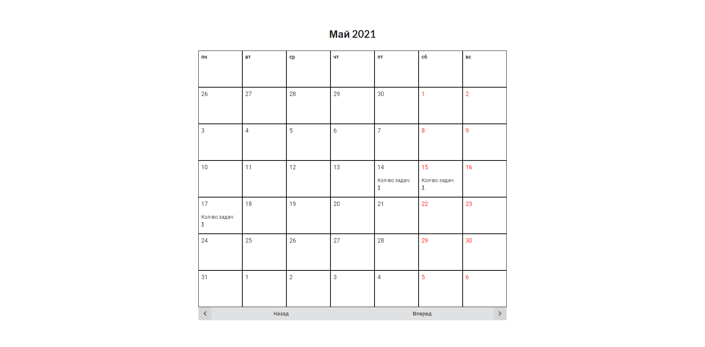
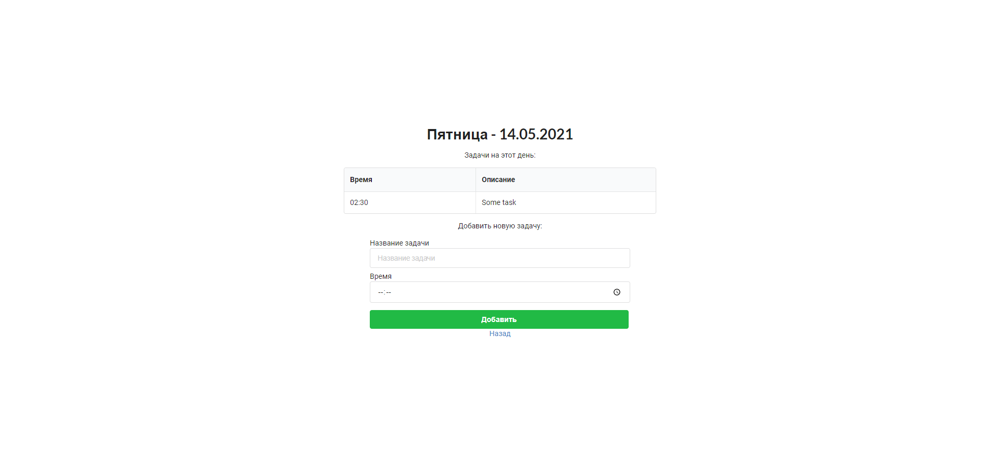

# task-manager
A Task Manager app. Test task solution for UBRAINIANS

## Getting Started

Task Manager is a Spring Boot application built using Maven. You can build a jar file and run it from the command line (JDK 11 is required).
<br>
There are two profiles: <b>default</b>(uses H2 Memory DB) and <b>sqlite</b>(uses SQLite DB). The active profile is <b>sqlite</b>.
<br>
DDL-auto behavior is set to 'create-drop' its mean that DB Schema with all inserted data will be dropped after the application stop.
<br>
To show application features there are pre-loaded data in DB.
<br>
Database stores data in data.db file.

```bash
git clone https://github.com/uniloftsky/task-manager
cd task-manager
./mvnw package
java -jar target/*.jar
```

You can then access app here: [http://localhost:8080](http://localhost:8080)

## Pages preview
Index page<br>

<hr>

A Day page with tasks<br>

